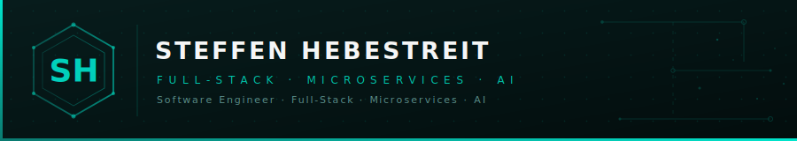

  

 

---

## Featured Project — OpenTYME

> **A full-stack business management platform for freelance professionals** — time tracking, invoicing, expense management, and AI-assisted reporting in one self-hosted application.

| Feature | Details |
|---|---|
| ⏱ **Time Tracking** | Timer & manual entry · billable/non-billable classification |
| 🧾 **Invoicing** | PDF export · ZUGFeRD/Factur-X compliance · payment monitoring |
| 💸 **Expenses** | S3 receipt uploads · tax categorization · depreciation schedules |
| 📊 **Reporting** | VAT declarations · EÜR reports · PDF / CSV / XLSX export |
| 📧 **Email** | Per-user SMTP config with MJML template editor & live preview |
| 🤖 **AI Assistant** | Conversational data access via configurable LLM providers |
| 🔌 **Plugin System** | Manifest-driven addons · slot-based frontend injection · AI tool registration |

### Build Your Own Addon

OpenTYME ships with a plugin architecture for extending the platform with custom backend routes, frontend UI slots, and AI tools.

**[opentyme-addon-boilerplate](https://github.com/SteffenHebestreit/opentyme-addon-boilerplate)** — the official starter template:

- TypeScript/Express backend + React/TypeScript frontend in one package
- Manifest-driven config via `addon-manifest.json`
- UI slots for expense forms, dashboards, and settings panels
- Three AI tool integration patterns: Swagger-auto · custom in-process · system prompt
- User authentication context built into all addon routes

---

## Other Projects

| Repository | Description | Stack |
|---|---|---|
| [a2a_mcp_express.js](https://github.com/SteffenHebestreit/a2a_mcp_express.js) | Node.js AI agent using Express, LangChain, MCP, and the Agent-to-Agent (A2A) protocol | TypeScript · Node.js |
| [fastapi_mcp_template](https://github.com/SteffenHebestreit/fastapi_mcp_template) | Template for custom MCP servers with dynamic tool mounting & containerized deployment | Python · FastAPI |
| [tts-stt-playground](https://github.com/SteffenHebestreit/tts-stt-playground) | Self-hosted platform for TTS synthesis, STT transcription, and voice cloning | Python · Docker |
| [ai-chat-frontend](https://github.com/SteffenHebestreit/ai-chat-frontend) | React frontend with 3D orb visualization & multimodal chat | React · JS |
| [color-scheme-generator](https://github.com/SteffenHebestreit/color-scheme-generator) | Responsive color scheme generator with dynamic hue selection and shade generation | CSS · JS |

---

## Tech Stack

---

